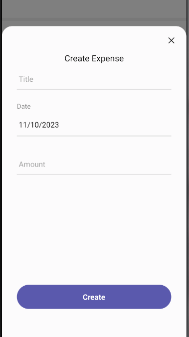
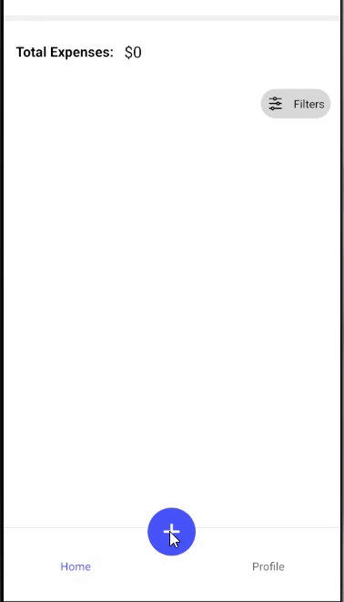

- RN-Sliding-Popup is a dynamic custom Modal view of React native, with a dynamic height and React native Animated animations.

- It comes with a built-in TypeScript typings.

# Animated sliding popup:

> **Dataset Properties**

| Name            | Type                  | Default |
| --------------- | --------------------- | ------- |
| precentegs      | Precentage[]          | []      |
| isVisible       | boolean               |
| onBackdropPress | () => void            |
| title           | string                |
| titleStyle      | TextStyle[] TextStyle |
| onPressProcceed | () => void            |
| durationEnter   | number                |
| durationExit    | number                |
| valueEnter      | number                |
| valueExit       | number                |
| startValue      | number                |
| onClickClose    | () => void            |
